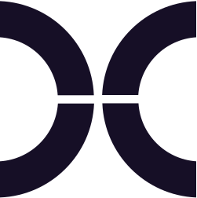

<h1 align="center">
    
</h1>

**`Aspiring Bioinformatician (Geneticist/Student/Coffee-Driven)`**

- 👩‍🔬 MSc Bioinformatics student focused on genomics and data science  
- 🧬 BSc Genetics graduate at the Universitat Autònoma de Barcelona, Spain  
- 💻 Currently working on building reproducible workflows to analyze large-scale genomic data  
- 🔍 Focused on population genomics, adaptation, and conservation using NGS datasets  
- 💭 Currently exploring machine learning & AI applications in bioinformatics and complex biological data  

#

### ☕ Connect with me:

 

### 🧰 Languages and Tools

<a href="https://www.nextflow.io/" target="_blank">
  <picture>
    <source media="(prefers-color-scheme: dark)" srcset="./img/nextflow-icon.svg">
    <source media="(prefers-color-scheme: light)" srcset="./img/nextflow-icon-dark.svg">
    
  </picture>
</a>

<a href="https://github.com/Cobos-Bioinfo" target="_blank">
  <picture>
    <source media="(prefers-color-scheme: dark)" srcset="https://user-images.githubusercontent.com/3369400/139447912-e0f43f33-6d9f-45f8-be46-2df5bbc91289.png">
    <source media="(prefers-color-scheme: light)" srcset="https://user-images.githubusercontent.com/3369400/139448065-39a229ba-4b06-434b-bc67-616e2ed80c8f.png">
    
  </picture>
</a>
