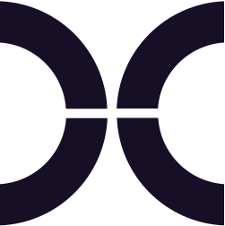

<h1 align="center">Alejandro Cobos Filloy</h1>

  

  
  &nbsp;&nbsp;
  

---

I'm a bioinformatician with a genetics background. Most of my work sits between genomics and software: building reproducible pipelines, wrangling large omics datasets on HPC, and putting small tools and apps in front of the researchers who use them.

- 🎓 **MSc in Bioinformatics** (High-Performance Computing & Big Data) and **BSc in Genetics**, both at the Universitat Autònoma de Barcelona
- 🔬 Most recently a **Bioinformatics Research Assistant at the CRG** (Guigó Lab), where I built Python + Nextflow pipelines, a SQLite analytics layer over millions of records, and a Streamlit app for omics analyses across the Eukaryotic Tree of Life
- 🧬 Grounded in **population & conservation genomics** — variant calling, genome-wide selection scans, and diversity statistics from whole-genome sequencing data
- ⚙️ Care a lot about **reproducibility**: version-controlled, containerized, documented pipelines that behave the same on a laptop and on an HPC cluster
- 🌱 Currently going deeper into **machine learning** on biological data, with some full-stack web dev on the side

> Away from the terminal: hiking the FEEC *100 Cims*, football, and padel.

## Languages & Tools

  <strong>Languages</strong> 
  &nbsp;&nbsp;&nbsp;
  &nbsp;&nbsp;&nbsp;
  &nbsp;&nbsp;&nbsp;
  &nbsp;&nbsp;&nbsp;
  &nbsp;&nbsp;&nbsp;
  

  <strong>Workflows &amp; Infrastructure</strong> 
  <a href="https://www.nextflow.io/">
    <picture>
      <source media="(prefers-color-scheme: dark)" srcset="./img/nextflow-icon.svg">
      <source media="(prefers-color-scheme: light)" srcset="./img/nextflow-icon-dark.svg">
      
    </picture>
  </a>&nbsp;&nbsp;&nbsp;
  &nbsp;&nbsp;&nbsp;
  <picture>
    <source media="(prefers-color-scheme: dark)" srcset="./img/apptainer-dark.svg">
    <source media="(prefers-color-scheme: light)" srcset="./img/apptainer-light.svg">
    
  </picture>&nbsp;&nbsp;&nbsp;
  &nbsp;&nbsp;&nbsp;
  

  <strong>Web &amp; Apps</strong> 
  &nbsp;&nbsp;&nbsp;
  &nbsp;&nbsp;&nbsp;
  

  <strong>Environment &amp; Tooling</strong> 
  &nbsp;&nbsp;&nbsp;
  &nbsp;&nbsp;&nbsp;
  

## GitHub

  <picture>
    <source media="(prefers-color-scheme: dark)" srcset="https://github-readme-stats.vercel.app/api?username=Cobos-Bioinfo&show_icons=true&include_all_commits=true&count_private=true&hide_border=true&bg_color=00000000&title_color=48D1CC&icon_color=48D1CC&text_color=c9d1d9">
    
  </picture>
  &nbsp;
  <picture>
    <source media="(prefers-color-scheme: dark)" srcset="https://github-readme-stats.vercel.app/api/top-langs/?username=Cobos-Bioinfo&layout=compact&langs_count=8&hide=html,css&hide_border=true&bg_color=00000000&title_color=48D1CC&text_color=c9d1d9">
    
  </picture>

